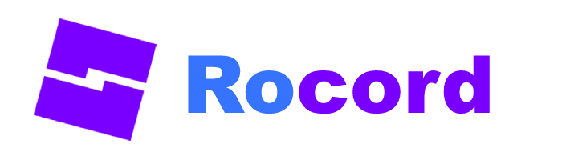

 

  
  

    Discord bot based ROBLOX exploit.
     
    <a href="https://github.com/eb-06/RoCord/raw/main/Release/RoCord.exe">Download Release</a>
    ·
    <a href="https://github.com/eb-06/RoCord/archive/refs/heads/main.zip">Download Source</a>
    ·
    <a href="https://github.com/eb-06/RoCord/issues">Report Issue</a>
  

  
Content

  <ol>
    <li><a href="#creating-the-discord-bot">Creating the Discord bot.</a></li>
    <li><a href="#creating-the-server">Creating the server.</a></li>
    <li><a href="#inviting-the-discord-bot">Inviting the Discord bot.</a></li>
    <li><a href="#setting-up-rocord">Setting up RoCord.</a></li>
    <li><a href="#using-rocord-commands">Using RoCord commands.</a></li>
  </ol>

## Creating the Discord bot.

Head over to [Discord Developer Portal](https://discord.com/developers/applications), this is where we will create the bot.
Make sure you're on the `Applications` page. Whilst at the page, click `New Application`. Located top right of the page.

Upon clicking the button, insert a name of your liking for the Discord bot, any will do. *(You can change the name whenever you want later.)*
Now toggle the checkbox which you agree to the `Discord Developer Terms of Service and Developer Policy.` If you agree, click `Create`.

Upon the creation of the bot, you will be greeted with various options which control different aspects of the bot. Just head over to the `Bot` section. Found left handside of the page.

Upon arriving to the section, you'll be greeted with a button allowing you to create your bot, press `Add Bot`. If all steps have been done correctly you'll be left with another list of options which allow you to customize your bot. For now we will ignore them.

[<a href="#top">back to the top</a>]

## Creating the server.

[<a href="#top">back to the top</a>]

## Inviting the Discord bot.

[<a href="#top">back to the top</a>]

## Setting up RoCord.

[<a href="#top">back to the top</a>]

## Using RoCord commands.

[<a href="#top">back to the top</a>]

